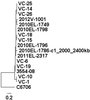
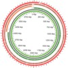
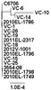

Microbial Informatics 2014 Labs
===============================

Welcome to the Microbial Informatics 2014 labs.  This page contains a number of tutorials on performing data analysis on whole genome sequencing data for the [Microbial Informatics][workshop-2014] workshop hosted at the National Microbiology Laboratory in Winnipeg, Canada.

Introduction
------------

The data for these tutorials is a set of whole genome sequencing data from a number of *V. Cholerae* strains from the [outbreak of cholera in Haiti][haiti-cholera] beginning in 2010 as well as a number of other *V. cholerae* strains included for comparison.  This data was previously published in http://mbio.asm.org/content/4/4/e00398-13.abstract and http://mbio.asm.org/content/2/4/e00157-11.abstract and is available on [NCBI's Sequence Read Archive](http://www.ncbi.nlm.nih.gov/sra/).

These tutorials do not go through the exact types of data analysis performed in the publications but should help in getting started working with microbial whole genome sequence data.

These labs assume that you are familar working within a Linux environment and using the command line.

Getting Lab Data
----------------

In order to get the data needed to run the labs please run the following command.

```bash
$ git clone https://github.com/apetkau/microbial-informatics-2014.git
```

This will copy all the instructions and other needed files to a directory, **microbial-informatics-2014/**.

Labs
----

| Day 6: May 14, 2014                                                         | Day 7: May 15, 2014                                                            |
|:---------------------------------------------------------------------------:|:------------------------------------------------------------------------------:|
| **8:45-10:45 am:** [Ortholog detection with OrthoMCL](labs/orthomcl)        | **12:30-2:00 pm:** [Core SNP Phylogenies](labs/core-snp)                      |
|   |      |
|                                                                             |                                                                                |
| **10:30-12:45 pm:** [Working with GView Server](labs/gview-server)          | **2:15-3:15 pm:** [Feature Frequency Profile Phylogenies](labs/ffp-phylogeny) |
|       |                           |
|                                                                             |                                                                                |
| **3:00-4:45 pm:** [Minimum Spanning Trees with PHYLOViZ](labs/mst)          |                                                                                |
|            |                                                                                |

[workshop-2014]: https://www.corefacility.ca/wiki/bin/view/BioinformaticsWorkshop/WorkshopMay2014
[haiti-cholera]: http://en.wikipedia.org/wiki/2010%E2%80%9313_Haiti_cholera_outbreak
