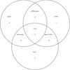
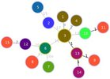

Microbial Informatics 2014 Tutorials
====================================

Welcome to the Microbial Informatics 2014 labs.  This page contains a number of tutorials on performing data analysis on whole genome sequencing data for the [Microbial Informatics](https://www.corefacility.ca/wiki/bin/view/BioinformaticsWorkshop/WorkshopMay2014) workshop hosted at the National Microbiology Laboratory in Winnipeg, Canada.

Introduction
------------

The data for these tutorials is a set of whole genome sequencing data from a number of *V. Cholerae* strains from the [outbreak of cholera in Haiti](http://en.wikipedia.org/wiki/2010%E2%80%9313_Haiti_cholera_outbreak) beginning in 2010 as well as a number of other *V. cholerae* strains included for comparison.  This data was previously published in http://mbio.asm.org/content/4/4/e00398-13.abstract and http://mbio.asm.org/content/2/4/e00157-11.abstract and is available on [NCBI's Sequence Read Archive](http://www.ncbi.nlm.nih.gov/sra/).

These tutorials do not go through the exact types of data analysis performed in the publications but should help in getting started working with microbial whole genome sequence data.

Labs
----

| Day 6: May 14, 2014                                                              | Day 7: May 15, 2014                                                                |
|:--------------------------------------------------------------------------------:|:----------------------------------------------------------------------------------:|
| **Lab:** [Ortholog detection with OrthoMCL](orthomcl-tutorial/README.md)         | **Lab:** [Feature Frequency Profile Phylogenies](ffp-phylogeny-tutorial/README.md) |
|           |                                  |
|                                                                                  |                                                                                    |
| **Lab:** Pan-genome BLAST Atlas with GView Server                                | **Lab:** [Core SNP Phylogenies](core-snp-tutorial/README.md)                       |
|                                                                                  |      |
|                                                                                  |                                                                                    |
| **Lab:** [Minimum Spanning Trees with PHYLOViZ](mst-tutorial/README.md)          |                                                                                    |
|             |                                                                                    |
