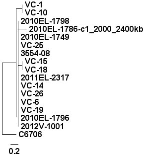

1. To change the minimum coverage from *2* to *5* please create a new file, *mapping.5.conf* and modify the *min_coverage* section to the following.
	
	```
	%YAML 1.1
	---
	min_coverage: 5
	freebayes_params: '--pvar 0 --ploidy 1 --left-align-indels --min-mapping-quality 30 --min-base-quality 30 --min-alternate-fraction 0.75'
	smalt_index: '-k 13 -s 6'
	smalt_map: '-n 1 -f samsoft -r -1 -y 0.5'
	```

   To re-run the phylogenetic pipeline please use the following commands.
	
	```bash
	$ snp_phylogenomics_control --mode mapping --input-dir cholera-files-subsample/fastq/ --reference cholera-files-subsample/reference/2010EL-1786-c1_2
000_2400kb.fasta --output output-10-subsample-5 --config mapping.5.conf
	```

   To find the total number of *valid* positions used please run.
	
	```bash
	$ grep --count -P "\tvalid\t" output-10-subsample-5/pseudoalign/pseudoalign-positions.tsv
	10
	```

   The following table compares both phylogenetic trees generated with the different minimum coverage values.
   
   | Minimum Coverage | Valid Positions | Phylogenetic Tree                                              |
   |:----------------:|:---------------:|:--------------------------------------------------------------:|
   | 2                | 28              |      |
   | 5                | 10              |  |

   The difference between the tree where the minimum coverage is 2 the tree where the minimum coverage is 5 is that with a minimum coverage of 5 the tree looks a bit flatter since there are less positions avaiable to differentiate some of the samples.

2. The phylogenetic tree generated from the whole genome looks as follows.
   
   

   The total number of variants used to generate this tree can be obtained using.
	
	```bash
	$ grep --count -P "\tvalid\t" output-10-example/pseudoalign/pseudoalign-positions.tsv
	360
	```

   This is over 10x the number of positions used when mapping to the 400kbp fragment of the genome.  This is reflected in the phylogenetic tree, which shows a bit more separation between the samples.
