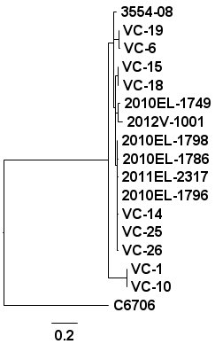

Core SNP Phylogenomics
======================

Introduction
============

Tutorial
========

This document walks through how to run the [core phylogenomics pipeline](https://github.com/apetkau/core-phylogenomics) to generate a set of SNPs and a phylogenetic tree based on whole genome sequencing data.  This tutorial assumes you have have the pipeline installed and that you have some familiarity with working on the command line in Linux.

Step 1: Obtaining input data
----------------------------

The input data to the core phylogenomics pipeline consists of a reference genome (in FASTA format) and a set of sequencing reads (in FASTQ format).  This data can be obtained with the following commands:

	$ wget http://wwwi/workshop/2014/data/core-snp-pipeline-data.tar.gz
	$ tar -xvf core-snp-pipeline-data.tar.gz

This will download and extract the data into two directories.  The first directory **reference/** contains the reference genome.  In this case, it is the concatenated chromosomes of V. cholerae 2010EL-1786, which can also be obtained from http://www.ncbi.nlm.nih.gov/nuccore/NC_016445.1 and http://www.ncbi.nlm.nih.gov/nuccore/NC_016446.1.  This file looks like:

	$ ls reference/
	2010EL-1786.fasta

	$ head reference/2010EL-1786.fasta
	>gi|360034408|ref|NC_016445.1| Vibrio cholerae O1 str. 2010EL-1786 chromosome 1, complete sequence
	TTTCATCAGGTCGTTTATGGTAATTTTTTTCATGTTTAGTCCTTACTCGACGTTGGCGAGTGCCAAATGC
	TGAGCCCATTGAGCGGTACTTGTTGCAATAACGCTTGGATTTCAGTCCCGTCTGGGAGGGTTAAATTTGG
	...

The second directory, __files-cov-10/__, contains the sequencing reads for all the other samples we will use to build a phylogenetic tree in FASTQ format.  These were downloaded from NCBI's [Sequence Read Archive](http://www.ncbi.nlm.nih.gov/sra/) and were reduced to 10x coverage for the purposes of this tutorial.  The directory looks like:

	$ ls files-cov-10/
	2010EL-1749.fastq  2010EL-1798.fastq  2012V-1001.fastq  C6706.fastq  VC-14.fastq  VC-18.fastq  VC-1.fastq   VC-26.fastq
	2010EL-1796.fastq  2011EL-2317.fastq  3554-08.fastq     VC-10.fastq  VC-15.fastq  VC-19.fastq  VC-25.fastq  VC-6.fastq

	$ head files-cov-10/2010EL-1749.fastq
	@HWUSI-EAS109E_0007_FC62MZGAAXX:6:89:1741:2665
	TGAAAATGTGATCAATGAAGGGTTTTAGCAATTAAC
	+
	egfggggggggggggdfccefffffcdfccffaffg
	...

For information on exactly how these files were generated please see [get_data.sh](../dataset/get_data.sh).

Step 2: Running the Core SNP pipeline
-------------------------------------

The command __snp_phylogenomics_control__ can used to generate a set of SNPs given the input data we just downloaded and build a whole genome phylogeny from a multiple alignment of these SNPs.  There are a number of different methods to building a whole genome phylogeny implemented in this pipeline but the method we will focus on for this tutorial is the reference mapping method.  

The reference mapping method can be run using the __--mode mapping__ parameter.  This requires as input the reference FASTA file, the FASTQ sequencing reads and a configuration file defining other parameters for the reference mapping mode.  For this tutorial, the configuration file is named __mapping.conf__ and looks like:

	%YAML 1.1
	---
	min_coverage: 2
	freebayes_params: '--pvar 0 --ploidy 1 --left-align-indels --min-mapping-quality 30 --min-base-quality 30 --min-alternate-fraction 0.75'
	smalt_index: '-k 13 -s 6'
	smalt_map: '-n 1 -f samsoft -r -1 -y 0.5'

The main parameter you will want to keep an eye on here is the __min_coverage__ parameter which defines the minimum coverage in a particular position to be included within the results.  For this tutorial we will leave the minimum coverage at 2 since the mean coverage for the downloaded data was 10.  For other data sets with different mean coverage values this number could be adjusted.

In order to run the pipeline, the following command can be used:

	$ snp_phylogenomics_control --mode mapping --input-dir files-cov-10/ --reference reference/2010EL-1786.fasta --output output-10 --config mapping.conf
	Running core SNP phylogenomic pipeline on Fri Apr 11 11:31:37 CDT 2014
	Core Pipeline git Commit: fa13fcc7d3a6e14fffa1082d6a1f05d3512e53a4
	vcf2pseudoalign git Commit: a2c73962ac48310c289b700976715c2d319d3227
	
	Parameters:
	...

When finished, you should expect to see the following output:

	================
	= Output Files =
	================
	tree: /home/aaron/Projects/MicrobialInformatics2014/core-snp-tutorial/output-10/phylogeny/pseudoalign.phy_phyml_tree.txt
	matrix: /home/aaron/Projects/MicrobialInformatics2014/core-snp-tutorial/output-10/pseudoalign/matrix.csv
	pseudoalignment: /home/aaron/Projects/MicrobialInformatics2014/core-snp-tutorial/output-10/pseudoalign/pseudoalign.phy
	stage: mapping-final took 0.00 minutes to complete
	pipeline took 6.95 minutes to complete

The main file you will want to check out is __output-10/phylogeny/pseudoalign.phy_phyml_tree.txt__, which is the computed phylogenetic tree.  This can be opened up using [FigTree](http://tree.bio.ed.ac.uk/software/figtree/) and should look similar to below.

\

Also, the file __output-10/pseudoalign/matrix.csv__ which contains a matrix of core SNP distances among all the input isolates.

	$ column -t output-10/pseudoalign/matrix.csv
	strain       2012V-1001  C6706  2010EL-1749  VC-6  VC-19  2010EL-1786  VC-18  2011EL-2317  VC-1  VC-10  VC-14  VC-15  VC-26  VC-25  2010EL-1796  2010EL-1798  3554-08
	2012V-1001   0           280    15           38    36     27           27     26           78    78     26     26     26     25     24           24           30
	C6706        280         0      273          272   270    269          269    268          268   268    268    268    268    267    266          266          264
	2010EL-1749  15          273    0            31    29     20           20     19           71    71     19     19     19     18     17           17           23
	VC-6         38          272    31           0     2      27           27     26           70    70     26     26     26     25     24           24           22
	VC-19        36          270    29           2     0      25           25     24           68    68     24     24     24     23     22           22           20
	2010EL-1786  27          269    20           27    25     0            16     5            67    67     5      15     5      4      3            3            19
	VC-18        27          269    20           27    25     16           0      15           67    67     15     1      15     14     13           13           19
	2011EL-2317  26          268    19           26    24     5            15     0            66    66     4      14     4      3      2            2            18
	VC-1         78          268    71           70    68     67           67     66           0     0      66     66     66     65     64           64           62
	VC-10        78          268    71           70    68     67           67     66           0     0      66     66     66     65     64           64           62
	VC-14        26          268    19           26    24     5            15     4            66    66     0      14     2      1      2            2            18
	VC-15        26          268    19           26    24     15           1      14           66    66     14     0      14     13     12           12           18
	VC-26        26          268    19           26    24     5            15     4            66    66     2      14     0      1      2            2            18
	VC-25        25          267    18           25    23     4            14     3            65    65     1      13     1      0      1            1            17
	2010EL-1796  24          266    17           24    22     3            13     2            64    64     2      12     2      1      0            0            16
	2010EL-1798  24          266    17           24    22     3            13     2            64    64     2      12     2      1      0            0            16
	3554-08      30          264    23           22    20     19           19     18           62    62     18     18     18     17     16           16           0

Also, the file __output-10/pseudoalign/pseudoalign-positions.tsv__ which includes every variant that was used by the pipeline for genetating the phylogenetic tree as well as those that were filtered out.

	$ head output-10/pseudoalign/pseudoalign-positions.tsv | column -t
	#Chromosome                    Position  Status             Reference  2010EL-1749  2010EL-1796  2010EL-1798  2011EL-2317  2012V-1001  3554-08  C6706  VC-1  VC-10  VC-14  VC-15  VC-18  VC-19  VC-25  VC-26  VC-6
	gi|360034408|ref|NC_016445.1|  17885     valid              T          T            T            T            T            T           T        G      T     T      T      T      T      T      T      T      T
	gi|360034408|ref|NC_016445.1|  24001     filtered-coverage  T          T            T            -            T            T           T        G      T     T      T      T      T      T      T      T      T
	...
	
This file contains a list of all variants detected by the pipeline, one per line.  Each variant is given a status, with 'valid' indicating that the variants at that position were used for further analysis.

A quick method to count the total number of 'valid' variants used to generate the phylogenetic tree and SNP matrix is with the following command:

	$ grep --count -P "\tvalid\t" output-10/pseudoalign/pseudoalign-positions.tsv
	360

Questions
=========

