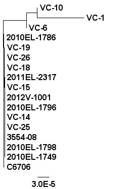
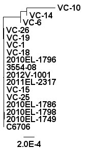
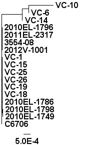
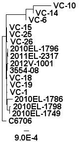
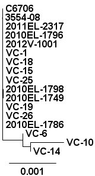
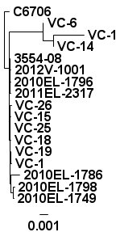

Answers
=======

Answer 1
--------

Running ffp with a kmer length of 10, 15, or 20 will generate a more diverse profile for each genome, but at the cost of taking longer to run.  The following table describes the running time and resulting trees.

| K-mer Length | Time (s) | Result                      |
|:------------:|:--------:|:---------------------------:|
| 5            | 2.7      |    |
| 10           | 2.7      |  |
| 15           | 5.7      |  |
| 20           | 131      |  |

Notice how the branch lengths are increasing and the genomes are beginning to visibly cluster as the kmer length increases.

Answer 2
--------

| K-mer Length | Time (s) | Result                              |
|:------------:|:--------:|:-----------------------------------:|
| 5            | 2.9      |    |
| 10           | 113      |  |

