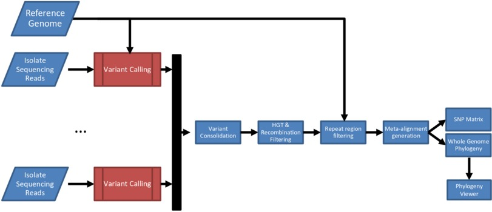
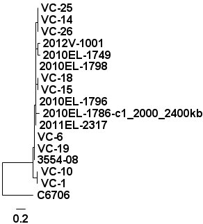
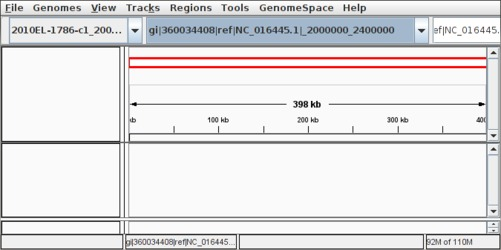
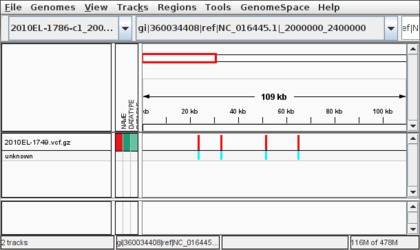
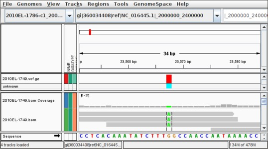

Whole Genome SNP Phylogenomics
==============================

Introduction
------------

Whole genome phylogenies are useful as a method for depicting the evolutionary relationships among a set of isolates or strains.  Unlike phylogenies based on a single gene or a small set of genes, whole genome phylogenies attempt to use data from the whole genome for constructing a phylogeny.  Some potential methods to generate whole genome phylogenies include:

* **Distance based**:  Generate a whole genome phylogeny from a distance matrix calculated based on whole genome data.  This will be explored a bit more in the [Feature Frequency Profiles Phylogeny](../ffp-phylogeny) lab later today.
* **Core-gene based**:  Identify a set of orthologous genes within the core genome of a set of isolates (see the [OrthoMCL](../orthomcl) lab) and use these orthologous genes to generate a phylogeny.
* **Reference mapping and variant calling**:  Perform reference mapping and variant calling from a set of sequencing reads to a reference genome and construct an alignment of variants in the core genome.  Use this alignment to generate a whole genome phylogeny.

This lab will explore the **reference mapping** approach using a [core phylogenomics pipeline](https://github.com/apetkau/core-phylogenomics) developed at the NML.  An introductory presentation on the pipeline can be found in the document [Day7PetkauCoreSNPIntroduction2014.pdf](https://www.corefacility.ca/wiki/pub/BioinformaticsWorkshop/WorkshopMay2014/Day7PetkauCoreSNPIntroduction2014.pdf), but the stages, in brief, are as follows.




1. Reference mapping and variant calling using [SMALT](http://www.sanger.ac.uk/resources/software/smalt/), [FreeBayes](https://github.com/ekg/freebayes) and [SAMtools/BCFtools](http://samtools.sourceforge.net/mpileup.shtml).
2. Merging and filtering variant calls.
3. Aligning SNPs into an alignment SNP table.
4. Building a Maximum Likelihood tree with [PhyML](http://www.atgc-montpellier.fr/phyml/).
5. Examining the tree with [FigTree](http://tree.bio.ed.ac.uk/software/figtree/).

A number of other options for building a whole genome phylogeny using the **reference mapping** method include.

* **Wombac**: <http://www.vicbioinformatics.com/software.wombac.shtml>
* **CSI Phylogeny**: <http://cge.cbs.dtu.dk/services/CSIPhylogeny/>
* **GenoBox**: <https://github.com/srcbs/GenoBox>
* **REALPHY**: <http://realphy.unibas.ch/fcgi/realphy>

Lab 1: Building a Core SNP Phylogenomic Tree
--------------------------------------------

This lab walks through how to run the core phylogenomics pipeline to generate a set of SNPs and a phylogenetic tree based on whole genome sequencing data.  This tutorial assumes you have have the pipeline installed and that you have some familiarity with working on the command line in Linux.

### Step 1: Constructing a Working Directory

To construct a working directory and obtain a copy of these instructions the following commands can be used.

```bash
$ git clone https://github.com/apetkau/microbial-informatics-2014.git
$ cd microbial-informatics-2014/labs/core-snp/
$ ls
Answers.md  images  mapping.conf  LargePhylogeny.md  README.md
```

### Step 2: Obtaining input data

The input data to the core phylogenomics pipeline consists of a reference genome (in FASTA format) and a set of sequencing reads (in FASTQ format).  The reference genome and sequencing reads are only a small section from the larger dataset which makes this overall pipeline a bit faster to run.  A walkthrough using the entire can be found in the document [LargePhylogeny.md](LargePhylogeny.md).

The data can be obtained with the following commands.

```bash
$ cp /Course/MI_workshop_2014/day7/cholera-files-subsample.tar.gz .
$ tar -xvf cholera-files-subsample.tar.gz
```

This will download and extract the data into two directories.  The first directory, **cholera-files-subsample/reference/**, contains the reference genome.  In this case, it is the region from 2mbp to 2.4mbp on chromosome I of *V. cholerae* 2010EL-1786.  This file looks like:

```bash
$ ls cholera-files-subsample/reference/
2010EL-1786-c1_2000_2400kb.fasta

$ head cholera-files-subsample/reference/2010EL-1786-c1_2000_2400kb.fasta
>gi|360034408|ref|NC_016445.1|_2000000_2400000
CCCGCTCGCCACGCTTTGGCCATAGTGCTGCCTTCTACGATGTGTAAACCGTGCAACTTAATGCCATCGGTGCCTACCTT
CAGTACTTGCTGTAACGTGGTGAGGTTTTCAGTGCGCTCTTCACCGGGTAACCCAACAATCAAGTGAGTACACACTTTGA
...
```

The second directory, __cholera-files-subsample/fastq/__, contains the sequencing reads for all the other samples we will use to build a phylogenetic tree in FASTQ format.  These were downloaded from NCBI's [Sequence Read Archive](http://www.ncbi.nlm.nih.gov/sra/) reduced in coverage to 10x, and then filtered so we kept only those reads that map to the subregion on the reference genome.  The directory looks like:

```bash
$ ls cholera-files-subsample/fastq/
2010EL-1749.fastq  2010EL-1798.fastq  2012V-1001.fastq  C6706.fastq  VC-14.fastq  ...

$ head cholera-files-subsample/fastq/2010EL-1749.fastq
@HWUSI-EAS109E_0007_FC62MZGAAXX:6:59:5084:8496
GAAACTGAGCTTATCCACTCCAGCAACTGCCAGCAC
+
ccccccacc[b^X`BBBBBBBBBBBBBBBBBBBBBB
@HWUSI-EAS109E_0007_FC62MZGAAXX:6:45:6427:12268
GATAACTACGATTCGTTTACTTACAACCTGTACCAA
...
```

For information on exactly how these files were generated please see the [Dataset](../../dataset/) section.

### Step 3: Running the Core SNP Pipeline

The command __snp_phylogenomics_control__ can used to generate a set of SNPs given the input data and build a whole genome phylogeny from a multiple alignment of these SNPs.  There are a number of different methods to building a whole genome phylogeny implemented in this pipeline but the method we are focusing on in this lab is the **reference mapping** method.  

The reference mapping method can be run using the __--mode mapping__ parameter.  This requires, as input, the reference FASTA file, the FASTQ sequencing reads and a configuration file defining other parameters for the reference mapping mode.  An example configuration file, named **mapping.conf**, is supplied and constains the following settings:

```
%YAML 1.1
---
min_coverage: 2
freebayes_params: '--pvar 0 --ploidy 1 --left-align-indels --min-mapping-quality 30 \
 --min-base-quality 30 --min-alternate-fraction 0.75'
smalt_index: '-k 13 -s 6'
smalt_map: '-n 1 -f samsoft -r -1 -y 0.5'
```

The main parameter you will want to keep an eye on here is the __min_coverage__ parameter which defines the minimum coverage in a particular position to be included within the results.  For this tutorial we will leave the minimum coverage at 2 since the mean coverage for the downloaded data is 10.  For other data sets with different mean coverage values this number could be adjusted.

In order to run the pipeline, the following command can be used:

```bash
$ snp_phylogenomics_control --mode mapping --input-dir cholera-files-subsample/fastq/ \
   --reference cholera-files-subsample/reference/2010EL-1786-c1_2000_2400kb.fasta \
   --output output-10-subsample --config mapping.conf
Running core SNP phylogenomic pipeline on Wed Apr 23 11:53:50 CDT 2014
Core Pipeline git Commit: c09e778dc9c51d9301b438b334f4c523de87bb4d
vcf2pseudoalign git Commit: a2c73962ac48310c289b700976715c2d319d3227

Parameters:
...
```

When finished, you should expect to see the following output:

```
================
= Output Files =
================
tree: /path/to/output-10-subsample/phylogeny/pseudoalign.phy_phyml_tree.txt
matrix: /path/to/output-10-subsample/pseudoalign/matrix.csv
pseudoalignment: /path/to/output-10-subsample/pseudoalign/pseudoalign.phy
stage: mapping-final took 0.00 minutes to complete
pipeline took 8.08 minutes to complete
```

#### Example Results

If the pipeline fails to run, then the rest of the lab can be performed with example results that have already been computed.  These can be obtained with the commands.

```bash
$ cp /Course/MI_workshop_2014/day7/output-10-subsample-example.tar.gz ./
$ tar -xvvzf output-10-subsample-example.tar.gz
```

This will extract the example data to a directory named **output-10-subsample-example/**.

### Step 4: Examine Results

The main file you will want to check out is __output-10-subsample/phylogeny/pseudoalign.phy_phyml_tree.txt__, which is the computed phylogenetic tree.  This can be opened up using [FigTree](http://tree.bio.ed.ac.uk/software/figtree/) and should look similar to below.



In order to get the exact tree layout as depicted above, please root on C6706 by selecting C6706 and using the **Reroot** button, then going to **Trees > Order nodes** and order by *decreasing*.

Another file to take a look at is __output-10-subsample/pseudoalign/matrix.csv__ which contains a matrix of core SNP distances among all the input isolates.

```bash
$ column -t output-10-subsample/pseudoalign/matrix.csv
strain                      2010EL-1749  C6706  2010EL-1786-c1_2000_2400kb  2012V-1001 ...
2010EL-1749                 0            21     4                           2          ...
C6706                       21           0      21                          21         ...
2010EL-1786-c1_2000_2400kb  4            21     0                           4          ...
2012V-1001                  2            21     4                           0          ...
VC-14                       3            20     3                           3          ...
```

Also, the file __output-10-subsample/pseudoalign/pseudoalign-positions.tsv__ which includes every variant that was used by the pipeline for genetating the phylogenetic tree as well as those that were filtered out.

```bash
$ head output-10-subsample/pseudoalign/pseudoalign-positions.tsv | column -t
#Chromosome          Position  Status             Reference  2010EL-1749  2010EL-1796  ...
...2000000_2400000   13149     filtered-mpileup   A          N            A            ...
...2000000_2400000   17132     valid              A          A            A            ...
...2000000_2400000   17872     filtered-coverage  T          T            T            ...
```
	
This file contains a list of all variants detected by the pipeline, one per line.  Each variant is given a status, with **valid** indicating that the variants at that position passed all the necessary checks.  *Note: since reference mapping was performed with respect to the region starting at 2mbp on chromosome I, all positions are indicated relative to this region.*

A quick method to count the total number of **valid** variants used to generate the phylogenetic tree and SNP matrix is with the following command:

```bash
$ grep --count -P "\tvalid\t" output-10-subsample/pseudoalign/pseudoalign-positions.tsv
28
```

Lab 2: Viewing SNPs in IGV
--------------------------

[IGV](http://www.broadinstitute.org/igv/) is an application which can be used to load up VCF files as well as pileup (BAM) files into multiple tracks.  This can be useful to get a perspective on the location of the variants on each genome.  In order to load up the VCF files in IGV the following steps can be used.

### Step 1: Launch IGV

1. Open a new terminal and run the command `igv`.

### Step 2: Load a Reference Genome

1. By default, IGV uses the human genome as a reference.  We wish to use 2010EL-1786-c1_2000_2400kb.fasta, as the reference.  In order to load a new reference, go to **Genomes > Load Genome From File ...**.
2. From here, find and load up the file **cholera-files-subsample/reference/2010EL-1786-c1_2000_2400kb.fasta**.  This should result in a screen that looks similar to below.




### Step 3: Index Variant VCF Files

IGV requires the variant (VCF) files to be compressed and indexed.  This can be accomplished using the tools `bgzip` and `tabix`.  To do this, please run the following in a terminal.

1. Switch to directory with VCF files.  This is either *output-10-subsample* for the files you ran, or *output-10-subsample-example* for the example files.

    ```bash
    $ cd output-10-subsample/vcf
    $ ls
    2010EL-1749.vcf  2010EL-1798.vcf  2012V-1001.vcf  C6706.vcf ...
    ```

2. Run `bgzip` within a loop to process all files at once.

    ```bash
    $ for i in *.vcf; do bgzip $i; done
    $ ls
    2010EL-1749.vcf.gz  2010EL-1798.vcf.gz  2012V-1001.vcf.gz  C6706.vcf.gz ...
    ```

    This can be read to say for every file ending in **.vcf**, store the name in some location called **i**, `for i in *.vcf`.  Then, run **bgzip** on these files `bgzip $i`.  This will take each file, for example **2010EL-1749.vcf** and compress it using `bgzip` to **2010EL-1749.vcf.gz**.

3. Run `tabix` within a loop to index all files.

    ```bash
    $ for i in *.vcf.gz; do tabix -p vcf $i; done
    $ ls
    2010EL-1749.vcf.gz      2011EL-2317.vcf.gz      C6706.vcf.gz ...
    2010EL-1749.vcf.gz.tbi  2011EL-2317.vcf.gz.tbi  C6706.vcf.gz.tbi ...
    ```

    This will take each file, for example **2010EL-1749.vcf.gz** and index it using `tabix` which creates a new file **2010EL-1749.vcf.tbi**.

### Step 4: Load Indexed VCF Files

1. In IGV, click on **File > Load From File...**.
2. Find and load one of the indexed VCF files, for example *2010EL-1749.vcf.gz*.  This should result in a screen that looks like the following.

    

3. Double-click the screen, or use the **-** and **+** buttons at the top to zoom in and out.  If no variants are visible, you may have to zoom in a bit more.

### Step 5: Load Mapping Alignments

IGV can also be used to load up the BAM files and display the alignments of all the reads.  To load a BAM file please do the following.

1. Go to **File > Load From File...**.  Find the directory *output-10-subsample/bam*.  Load up one of the BAM files from this directory, for example **2010EL-1749.bam**.

    *Note: Although these BAM files have already been indexed by the SNP pipeline, in general IGV needs indexed BAM files.  Indexing can be done using the `samtools index` command.*
2. Once the BAM file is loaded, you should be able to drag & drop to re-arrange the order of the tracks.  You may need to zoom in before any read information is loaded from the BAM file.   Once everything is loaded up you should see a screen similar to the following.

    

Questions
---------

### Question 1

The **minimum coverage** setting within the **mapping.conf** file can have a large effect on the total number of valid positions used to generate the tree.  Please try re-running the pipeline with a minimum coverage of *5*.  What effect does this have on the total number of **valid** variants used to generate the phylogenetic tree?  What effect does this have on the phylogenetic tree generated?

### Question 2

The above tutorial generates a phylogeny using only a 400kbp fragment of the whole genome.  It would be expected that a more complete picture can be obtained by extracting variants using the entire genome, but this takes more time to run.  An example set of results obtained from running the pipeline on the entire genome (see the walkthrough in the document [LargePhylogeny.md](LargePhylogeny.md) for more information) can be obtained by running the following.
    
```bash
$ cp /Course/MI_workshop_2014/day7/output-10-example.tar.gz ./
$ tar -xvvzf output-10-example.tar.gz
```

This will extract the results into a directory __output-10-example/__.

#### Part A

Please examine the resulting whole genome phylogeny and the number of positions used to generate the phylogeny.  How does using the whole genome compare to only using a fragment of the genome?

#### Part B

Please follow through indexing and loading up the VCF files for this dataset, _output-10-example/vcf_, in IGV.  How does this compare to the files from **Lab 2**?

*Note: You can use CTRL+Click to select multiple files at once.*

[Answers](Answers.md)
