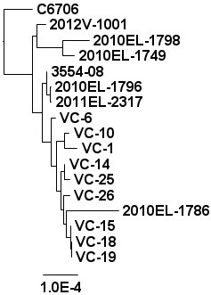
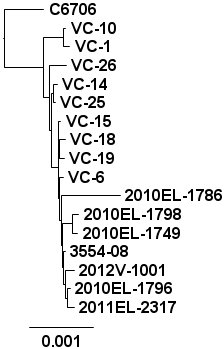
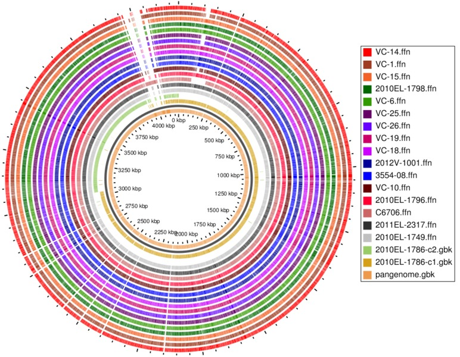

Answers
=======

Answer 1
--------

Running ffp with a kmer length of 10, 15, or 20 will generate a more diverse profile for each genome, but at the cost of taking longer to run.  The following table describes the running time and resulting trees.

| K-mer Length | Time (s) | Result                             |
|:------------:|:--------:|:----------------------------------:|
| 5            | 2.7      |    |
| 10           | 2.7      |  |
| 15           | 5.7      |  |
| 20           | 131      |  |

Notice how the branch lengths are increasing and the genomes are beginning to visibly cluster as the kmer length increases.

Answer 2
--------

| K-mer Length | Time (s) | Result                                     |
|:------------:|:--------:|:------------------------------------------:|
| 5            | 2.9      |    |
| 10           | 113      |  |

Note: The publication at http://www.ncbi.nlm.nih.gov/pmc/articles/PMC2806744/ describes a method for selecting the best parameters and also shows that the trees will converge quickly to a stable solution as the k-mer length increases.  They also describe a method for computing statistical support for the branching order of the major groups.  Please also see the publication http://www.pnas.org/content/108/20/8329 and the [documentation](http://sourceforge.net/projects/ffp-phylogeny/files/?source=navbar) for the FFP software for more details.

Answer 3
--------

Constructing the amio acid sequence-based tree can be accomplished with the following.

```bash
$ ffpaa -l 5 annotations/*.faa | ffpcol -a | ffprwn | ffpjsd -p genome_names_faa.txt | ffptree > tree-5-aa.txt
```

This generates a tree that should look similar to below.



Some differences are that the amino acid sequence tree separates some of the branches of the tree a bit more visibly and the branch lengths are quite a bit shorter (especially those between VC-6, VC-10, VC-14, and the rest).

Answer 4
--------

The core feature, phenetic feature, and core SNP phylogenies for a k-mer length of 20 are.

| Core Feature                                | Phenetic Feature                   | Core SNP                   |
|:-------------------------------------------:|:----------------------------------:|:--------------------------:|
|  |  | ![core snp][core-snp-tree] |

Some differences include:

* The core SNP gives a much larger relative distance to C6706 as compared to the FFP trees, but all three trees place it much more distant from any other genome.
* Both the trees generated from the core genome cluster (VC-1,VC-10) together and separate from any other genome.
* Both the FFP trees give a much larger distance to the branch containing 2010EL-1786 than does the core SNP tree.  A possible cause could be because 2010EL-1786 is the only closed and finished genome in this dataset (that is, the gaps in between contigs are filled in, and there will most likely be less artifacts from the assembly method which could introduce extra and possibly common data with all other genomes).

Both the core feature and core SNP phylogeny would exclude any regions that are not part of the core genome.  That is, regions where there are gaps in the pan-genome BLAST Atlas.  Some of the larger such regions include:

* ~100 kbp on the pan-genome BLAST Atlas where C6706 has the largest region missing, and VC-10,VC-26,VC-25,VC-15,VC-1 all have smaller gaps.
* ~4000 kbp on the pan-genome BLAST Atlas where C6706 has a large unique region, and VC-10, VC-1 have smaller unique regions.

 

[core-snp-tree]: ../core-snp/images/output-10-tree.jpg
