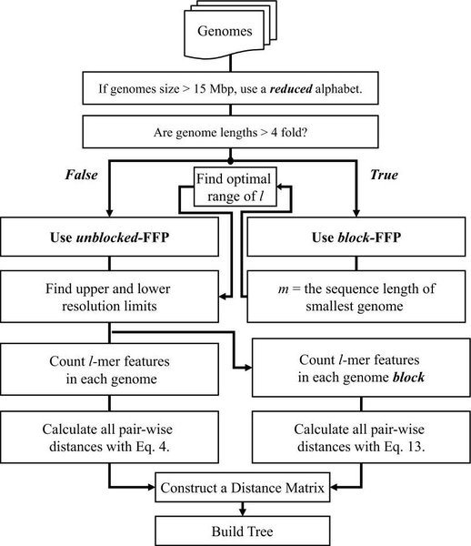

Feature Frequency Profiling Phylogeny Tutorial
==============================================

This project contains a tutorial for clustering genomes by frequences of kmers using <http://sourceforge.net/projects/ffp-phylogeny/> software.  This uses a custom version of ffp-phylogeny available at <https://github.com/apetkau/ffp-3.19-custom>.

Introduction
------------

The Feature Frequence Profile method of phylogenetic comparison is a quick, alignment-free method for calculating a genetic distance between whole genomes and constructing a phylogenetic tree from these distances.  This method is described in in publications such as.

* Sims GE, Jun SR, Wu GA, Kim SH. (2009) [Alignment-free genome comparison with feature frequency profiles (FFP) and optimal resolutions.](http://www.ncbi.nlm.nih.gov/pubmed/19188606) PNAS, 106,2677-82.
* Sims GE and Kim SH (2011) [Whole-genome phylogeny of Escherichia coli/Shigella group by feature frequency profiles (FFPs).](http://www.pnas.org/content/108/20/8329.full) PNAS, 108, 8329-34.

An overview of this method can be found in the following image.

[](http://www.ncbi.nlm.nih.gov/pmc/articles/PMC2634796/figure/F5/)

We will use the unblocked-FFP which is meant for smaller genomes.  The main steps of this method are.

### Step 1: Count k-mers

This step uses `ffpry` to count k-mer frequencies in each genome and generates a vector storing the k-mer frequencies.  For example, with the below genomes.

```
>genome1
AATT

>genome2
AAGG
```

The following would be the 1-mer frequencies.

```
>genome1
A 4

>genome2
A 2 C 2
```

The following would be the 2-mer frequencies.

```
>genome1
TT 2 AT 1

>genome2
TT 1 AG 1 CC 1
```

*Note: The k-mer frequency counts for reverse complemented k-mers (so for A and T in the 1-mer counts) are merged together.*

### Step 2: Relative k-mer counts

This step uses `ffpcol` and `ffprwn` to convert k-mer counts to relative frequencies for each genome.  This is accomplished by dividing the k-mer count for a genome by the sum of all k-mer counts in a genome.

* For 1-mer counts.

    * Sum for **genome1** is 4 so every 1-mer in genome1 is divided by 4.
    * Sum for **genome2** is 4 so every 1-mer in genome2 is divided by 4.

    ```
                A               C
    genome1     1.00e+00        0.00e+00
    genome2     5.00e-01        5.00e-01
    ```

* For 2-mer counts

    * Sum for **genome1** is 3 so every 2-mer is divided by 3.
    * Sum for **genome2** is 3 so every 2-mer is divided by 3.

    ```
                AG              AT              CC              TT
    genome1     0.00e+00        3.33e-01        0.00e+00        6.67e-01
    genome2     3.33e-01        0.00e+00        3.33e-01        3.33e-01
    ```

### Step 3: Distance Matrix

This step uses `ffpjsd` to construct a distance matrix based on all the relative k-mer frequencies in each genome using some distance metric (default is [Jensen-Shannon divergence](http://en.wikipedia.org/wiki/Jensen%E2%80%93Shannon_divergence)).  A distance of *0* would indicate no difference in any k-mer frequency profile for two genomes while a larger number indicates a greater distance.  For example, for the two genomes above we get the following distance matrices.

For 1-mer counts.

```
            genome1    genome2
genome1     0.00e+00   1.89e-01 
genome2     1.89e-01   0.00e+00
```

For 2-mer counts.

```
            genome1    genome2
genome1     0.00e+00   4.58e-01 
genome2     4.58e-01   0.00e+00
```

### Step 4: Construct Tree

This step uses `ffptree` to construct a distance-based phylogenetic tree using the distance matrix.  This is accomplished using the Neighbor-joining (default) or UPGMA methods.

Lab
---

The below steps go through generating FFP phylogenies for the *V. Cholerae* data.

### Step 1: Construct Working Directory

To construct a working directory for this lab and obtain a copy of the instructions the following commands can be used.

```bash
$ git clone https://github.com/apetkau/microbial-informatics-2014.git
$ cd microbial-informatics-2014/labs/ffp-phylogeny/
$ ls
Answers.md  images  README.md
```

### Step 2: Download Software

Download software from <https://github.com/apetkau/ffp-3.19-custom> and install using the following steps:

```bash
$ git clone https://github.com/apetkau/ffp-3.19-custom.git
$ cd ffp-3.19-custom/
$ mkdir software
	
$ ./configure --disable-gui --prefix=`pwd`/software
$ make
$ make install

$ echo export PATH=`pwd`/software/bin:\$PATH >> ~/.bashrc
$ source ~/.bashrc
$ cd ..
$ ls
Answers.md  ffp-3.19-custom  images  README.md
```

Once these steps are complete, you can test if the software is installed by running `ffpre`.  For example:

```bash
$ ffpre
Usage: ffpry [OPTION]... [FILE]... 
Try `ffpry --help' for more information
```

### Step 3: Input Files

The input files for this software are assembled genomes in FASTA format.  The input data for this tutorial can be obtained with the following commands.

```bash
$ cp /Course/MI_workshop_2014/day7/contigs-cholera.tar.gz ./
$ tar -xvf contigs-cholera.tar.gz
```

The above commands will create a directory __contigs/__ containing the assembled genomes in FASTA format.  This directory looks as follows.

```bash
$ ls contigs
2010EL-1749.fasta  2010EL-1796.fasta  2011EL-2317.fasta  3554-08.fasta ...
$ head contigs/2010EL-1749.fasta
>NODE_1_length_53485_cov_3.80401_ID_1
CTAAAAGGGGAGGGAACTGGATTTGTGTTCACTTGGAGTTTATTGCAGATTGTTGAGGGA
TAACGTGTTTATAGACATTTTAGAGTTAAAGCCTTAACTCTAAATCATTCGTTTCGGATT
```

### Step 4: Generate genome name list

In order to build a tree using `ffp` a list of all the names of each genome must be provided, one genome per line.  These must be in the same order as is processed by the commands in **Step 5**.  Each name must be unique and can be no more than 50 characters (original version was no more than 10 characters).  This file can be generated with the following commands:

```bash
$ ls contigs/*.fasta | sed -e 's/^contigs\///' -e 's/\.fasta$//' > genome_names.txt
```

This will generate a file **genome_names.txt** that looks like the following:

```bash
$ cat genome_names.txt
2010EL-1749
2010EL-1786
2010EL-1796
2010EL-1798
2011EL-2317
2012V-1001
3554-08
C6706
VC-10
VC-14
VC-15
VC-18
VC-19
VC-1
VC-25
VC-26
VC-6
```

Note: Adding or modifying any of the genomes within the **contigs/** directory will require re-generating the **genome_names.txt** file.

### Step 5: Build Phylogeny

In order to build the phylogeny the following command can be used:

```bash
$ ffpry -l 5 contigs/*.fasta | ffpcol | ffprwn | ffpjsd -p genome_names.txt | ffptree \
   > tree-5.txt
17 Taxa

Cycle   Type    i       Length          Type    j       Length
----------------------------------------------------------------
14      T       9       -4.80e-05       T       14      1.19e-04
...
```

This command generates a neighbor-joining tree from the set of genomes and writes the tree to a file **tree-5.txt**.

### Step 6: View with FigTree

In order to view the generated tree the following command can be used.

```bash
$ figtree tree-5.txt
```

This should display a tree similar to below.


In order to get the exact tree layout as depicted above, please root on C6706 by selecting C6706 and using the **Reroot** button, then going to **Trees > Order nodes** and order by *increasing*.

Questions
---------

### Question 1

The constructed tree used a kmer length of 5 by default `ffpry -l 5`.  What effect do you think adjusing this value would have on the final result?  Please adjust this value to 10 by running:

```bash
$ ffpry -l 10 contigs/*.fasta | ffpcol | ffprwn | ffpjsd -p genome_names.txt | ffptree \
   > tree-10.txt
```

What effect does this have on the resulting tree?  Try adjusting to 15 and 20.

### Question 2

By default, the `ffpry` software will compress the nucleotide characters into one of two states: either a purine __R__ or pyrimidine __Y__.  This can be seen by examining the output of the `ffpry` program.

	$ ffpry -l 2 contigs/2010EL-1749.fasta
	RR      1988920 RY      1013697 YR      1013730

This shows the different 2-mer counts, 1988920 for combination RR, 1013697 for combination RY, and 1013730 for combination YR from __2010EL-1749__, encoded as either a purine or a pyramidine.  *Note: There are no YY counts because these are combined with the reverse complimented (RR) counts.* 

It's possible to remove the compression to __R__ or __Y__ and leave the 4 state nucleotide encoding by using the `-d` parameter.  For example:

	$ ffpry -d -l 2 contigs/2010EL-1749.fasta
	TA      191171  TC      476051  TG      587034  TT      662771  AC ...

For a given k-mer size, this will result in more information being generated.  To construct a tree with the nucleotide counts we can use (don't forget __-d__ in `ffpcol` as well):

	$ ffpry -d -l 5 contigs/*.fasta | ffpcol -d | ffprwn | ffpjsd -p genome_names.txt \
	   | ffptree > tree-5-dna.txt

Run this for a kmer size of 5 and 10.  What differences do you notice in the tree as well as the running time?

### Question 3

The Feature Frequency Profile method of constructing phylogenies can also be run on amino acid sequence data as well as nucleotide data.  This requires access to the genome annotations instead of the contigs.  These can be accessed by running.

```bash
$ cp /Course/MI_workshop_2014/day6/annotations-cholera.tar.gz ./
$ tar -xvzf annotations-cholera.tar.gz
$ ls annotations/
2010EL-1749.faa  2010EL-1786.ffn  2010EL-1798.faa  2011EL-2317.ffn  3554-08.faa ...
```

This extracts the annotations which were used in the previous annotations lab.  The amino acid sequence data are stored within the __.faa__ files.  For example:

```bash
$ head annotations/2010EL-1749.faa
>2010EL-1749_00001 Stalked cell differentiation-controlling protein
MDARLFDNTQTLRASVLCGLSFFWALIAFLMALINFWSTRLVELASLELVCAFYSLYIYS
LAKRRIHTKQQVYLYLFILTGTTLFATYMKPLMMGVYIWSCFVPILFYIFTSARFAFVTS
```

To use the amino acid data the program `ffpaa` needs to be used instead of `ffpry`.  This will count the frequency of amino acid symbols instead of nucleotide symbols.  For example.

```bash
$ ffpaa -l 2 annotations/2010EL-1749.faa
FA	8462	FC	1182	FD	10330 ...
```

This also requires the `-a` option to the `ffpcol` program.

This also requires constructing a new genome names **genome_names_faa.txt** file defining the order of the genomes (since we are using different files).  This can be generated with.

```bash
$ ls annotations/*.faa | sed -e 's/^annotations\///' -e 's/\.faa$//' > genome_names_faa.txt
```

Please use what you know to construct an amio acid ffp tree with a k-mer length of 5 using the files ``annotations/*.faa``.  What differences do you notice?

### Question 4

In [Whole-genome phylogeny of Escherichia coli/Shigella group by feature frequency profiles (FFPs)](http://www.pnas.org/content/108/20/8329.full) the authors discusses using this same FFP method to construct two different types of phylogenies (depicted in [Figure 1](http://www.pnas.org/content/108/20/8329/F1.expansion.html)).

* **Phenetic phylogeny**:  This phylogeny is constructed from all k-mers computed from every genome. This is the type we have been constructing throught this lab.
* **Core Feature/Evolutionary phylogeny**:  This phylogeny is constructed by considering only core k-mers (that is, k-mers contained within every genome).

A similar **Core Feature** can be constructed by first filtering out k-mers using the `ffpfilt` program (which takes the place of `ffpcol`).  This can be accomplished with.

```bash
$ ffpry -l 20 contigs/*.fasta | ffpfilt -l 0.05 -u 0.95 -e -s | ffprwn \
   | ffpjsd -p genome_names.txt | ffptree > tree-core-20.txt
```

#### Part A

Compare the **Core Feature** tree generated from this command to the **Phenetic phylogeny** tree generated with a k-mer length of 20 from **Question 1**.  Compare also to the [Core SNP](../core-snp/Answers.md) phylogeny from the previous lab **question 2**.  How do they differ?

#### Part B

Using the depiction of the core genome from the [pan-genome BLAST Atlas](../gview-server/README.md) constructed yesterday in **Question 1**, which regions would have been excluded from the **core feature** and **core SNP** trees?

[Answers](Answers.md)
