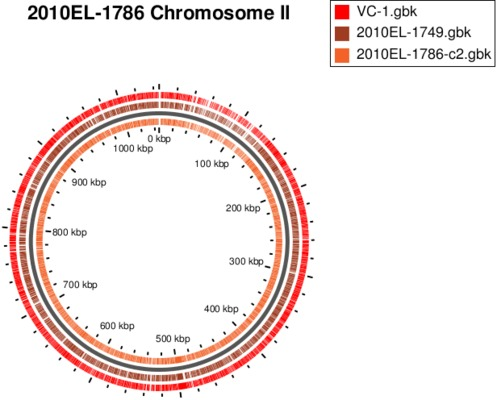
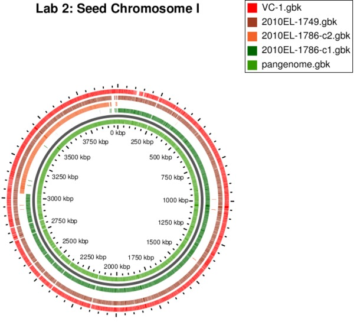
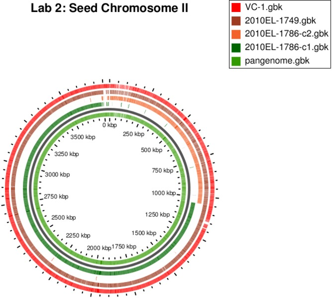

GView Server Answers
====================

Lab 1
-----

1. The following table shows a comparison of the BLAST atlas for both chromosomes.

   | Chromosome I                           | Chromosome II                          |
   |:--------------------------------------:|:--------------------------------------:|
   |  |  |

   A few differences include:

   * Chromosome I is ~3 mbp in length where as Chromosome II is ~1 mbp in length.
   * VC-1 on Chromosome I has a small region around position 100 kbp which is missing when compared to 2010EL-1786 and 2010EL-1749.
   * Chromosome I contains a number of small gaps missing from all genomes (for example around 2150 kbp).  These correspond to RNA coding regions which were not selected to be displayed in the **Customize Appearance** screen.

Lab 2
-----

1. The following table shows a comparison of the pan-genome BLAST Atlas using both Chromosomes as the seed genome.

   | Seed: Chromosome I                      | Seed: Chromosome II                        |
   |:---------------------------------------:|:------------------------------------------:|
   |  |  |

   The main difference is with the positions of features on the pan-genome.  Starting with a seed genome of Chromosome II places Chromosome II at the very beginning of the atlas (from position 0 kbp to 1000 kbp).
