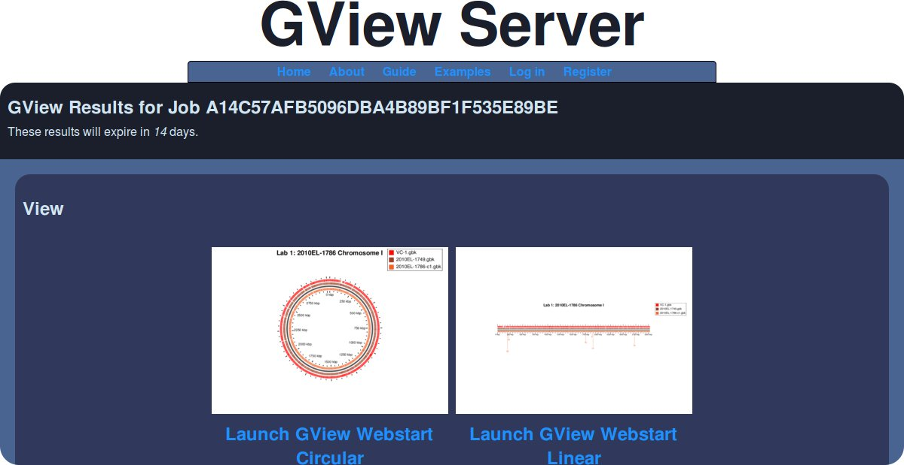

Working with GView Server
=========================

Introduction
============

[GView Server](http://server.gview.ca) is a web-based application for performing comparative genomics analysis.  Genomes can be uploaded and multiple categories of analysis types can be performed on these files.  The types of analysis include:

* BLAST Atlas
* Pangenome BLAST Atlas
* Core genome
* Unique genes
* Signature genes
* Reciprocal BLAST

Results for each analysis type are displayed using [GView](http://www.gview.ca) a circular and linear genome viewer.  GView can be used to make modifications to the appearance of the results and export the genome map to an image file.

In this lab, we will go through a number of different analysis types using GView Server, and how to modify the results in GView.

Lab 1: BLAST Atlas
------------------

A BLAST ATlas is used to depict the prescence and abscence of particular regions within a set of genomes.  The precscence or abscence of a region is determined by running [BLAST](http://en.wikipedia.org/wiki/BLAST) between these regions.  The BLAST results are compiled into a table and are used to generate an image using GView.  In order to construct a BLAST Atlas using the cholera data please proceed through the following steps.

1. **_Go to GView Server_**
  a. Go to http://server.gview.ca.
2. **_Select Analysis Type_**
  a. Set the **Analysis Type** to *BLAST Atlas*.
3. **_Upload Reference Genome_**
  a. Click on **Browse** and find */Course/MI_workshop_2014/day6/gview-server-annotations/2010EL-1786-c1.gbk*.  This will be the reference for used to run BLAST against.
  b. Click **Continue** (you can optionally enter your email address if you want the results emailed to you).  This will now upload the reference genome to GView Server.
4. **_Upload Query Genomes_**
  a. Click on **Browse** next to **Select a sequence file**.
  b. Select */Course/MI_workshop_2014/day6/gview-server-annotations/other-genomes/2010EL-1749.gbk*.
  c. Click on the **Plus** icon [plus](images/plus-button.png) to add a new file to upload.
  d. Click on **Browse** and select the file *VC-1.gbk*.
  d. Click on **Continue** when finished.  This should now upload all the selected genomes to GView Server.
5. **_Adjust BLAST Parameters_**
  a. In this screen it's possible to adjust some of the settings for BLAST.  For this example we will keep the default settings.  Click on **Continue** to proceed.
6. **_Customize Appearance_**
  a. In this screen it's possible to adjust the appearance settings of the BLAST Atlas.  Within the **Map title** text field please enter *Lab 1: 2010EL-1786 Chromosome I*.
  b. No other settings need to be adjusted so click on **Complete** to start the analysis.
7. **_Wait for Analysis Results_**
  a. The next screen will give you a job id where your results can be found on completion.  Click on the link and wait for your analysis results to finish.
  b. On completion, you should see a screen similar to below.

  

