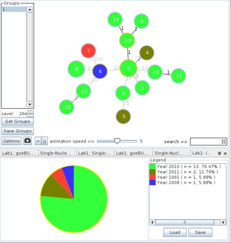
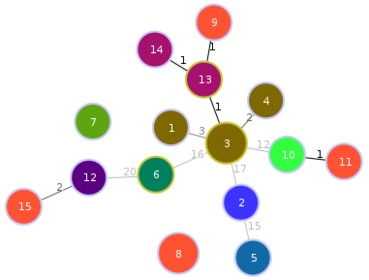
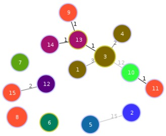
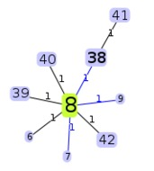
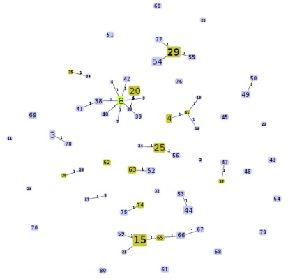
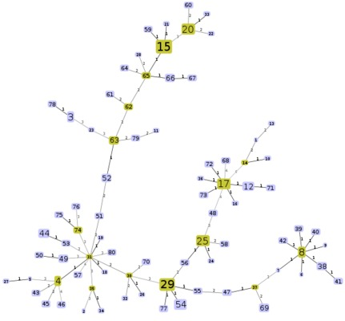

PHYLOViZ Answers
================

Lab 1
-----

1. The tree with the year of collection data added looks as follows.

   

   The most common year represented is 2010 (with 13).  The least common years are 1991 and 2008 (with 1 each).

2. Images for the tree and the isolates left out when adjusting to the different levels are as follows.

   * Level 20:  isolates 7 (C6706) and 8 (VC-1,VC-10) are left out.

   

   * Level 15:  isolates 2 (2010EL-1749),5 (2012V-1001),6 (3554-08),7 (C6706),8 (VC-1,VC-10),12 (VC-19),15 (VC-6).

   

Lab 2
-----

1. Viewing the location data should give you an image that looks like the following.

   

2. Below are some example screenshots from running goeBURST at each of the different levels.

   * DLV

   

   * TLV

   

   * Full MST

   

   The differences would be that more isolates are included within the same groups as the levels (DLV, TLV) increases.  With the Full MST, every isolate is connected within the same group.
