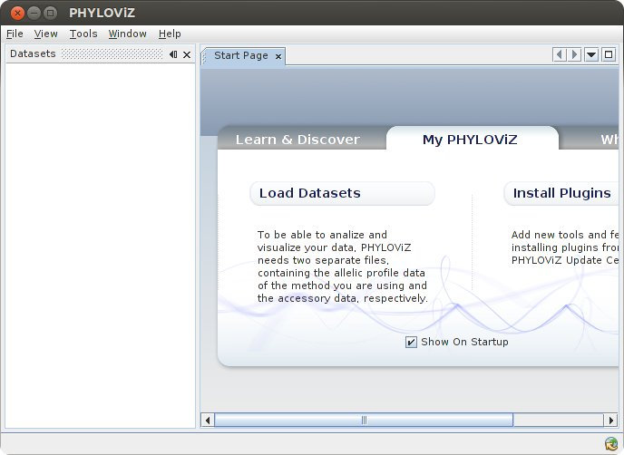
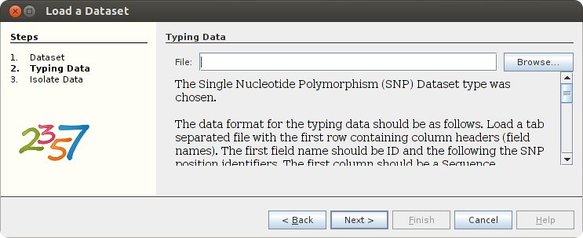
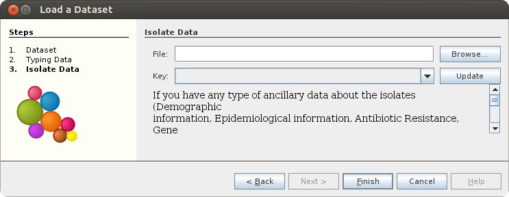
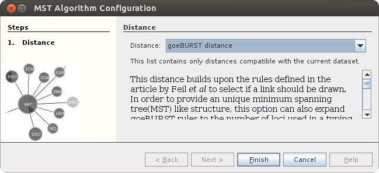
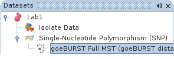
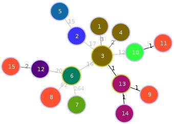

Minimum Spanning Trees and goeBURST with PHYLOViZ
=================================================

Introduction
------------

[PHYLOViZ](phyloviz) is a desktop application for performing analysis on sequence-based typing data (such as MLST, MLVA, or SNP data).  PHYLOViZ can calculate possible evolutionary relationships by using the [goeBURST][goeburst] algorithm and provides an interface for visualization of the results.  More information on phyloviz can be found at <http://www.phyloviz.net/> and a short presentation introducing goeBURST can be found at [Day6LabPetkauPhylovizgeoBURSTMay2014.pdf][mst-phyloviz-intro].

Preparation
-----------

### Constructing a Working Directory

To construct a working directory and obtain a copy of these instructions the following commands can be used.

```bash
$ git clone https://github.com/apetkau/microbial-informatics-2014.git
$ cd microbial-informatics-2014/labs/mst/
$ ls
Answers.md  lab1-snp-profile.tsv  PrepareInput.md  sampleADfile.txt
images      lab1-snp-strains.tsv  README.md        sampleAPfile.txt
```

### Starting Phyloviz

In order to start PHYLOViZ the following command can be entered in a terminal.

```bash
$ phyloviz
```

This should launch PHYLOViZ which should look similar to the following.




Lab 1: Minimum Spanning Tree with SNP Data
------------------------------------------

This lab will walk you through building a minimum spanning tree using SNP data.  The SNP data we will be using was generated using the methods described in the tutorial on [Core SNP Phylogenies](https://github.com/apetkau/microbial-informatics-2014/tree/master/labs/core-snp) lab which we will explore in more details tomorrow.  In particular, the SNP data comes from the file __pseudoalign-positions.tsv__ from the Core SNP Phylogenies lab.  More information on the necessary steps for converting this SNP data to a form PHYLOViZ can process is found within the document [PrepareInput.md](PrepareInput.md).

Please follow the below steps to generate a minimum spanning tree with this SNP data.

### Step 1: Load Dataset

1. Click on **File > Load Dataset**

2. Name this dataset *Lab1*.  Set the **Dataset Type** to *SNP*.  When finished, click Next.  This should bring you to a **Typing Data** screen that looks similar to the following.

    

3. Click on **Browse...** and find the file *microbialinformatics2014/labs/mst/lab1-snp-profile.tsv*.  This file contains a set of sequence types (in column *ST*) defined based on the SNP data at different positions.

    This file looks similar to the following.

    ```	
    ST  gi|360034408|ref|NC_016445.1|_17885  gi|360034408|ref|NC_016445.1|_28297
    1   T                                    A
    2   T                                    A
    3   T                                    A
    ```

    The screen you should see looks similar to the following.

    

    Click **Next** to continue.

4. Click on **Browse...** and find the file *lab1-snp-strains.tsv*.  This file contains a mapping of the sequence types (in column *ST*) to strain IDs and other information.  Please make sure that the **Key** drop down menu is set to *ST* to indicate that this column contains the sequence types.  Click **Finish** to finish loading the data.  The file that was loaded looks similar to below.

    ```
    ST      Strain        Location   Year    NCBI Accession
    1       2010EL-1786   Haiti      2010    NC_016445.1,NC_016446.1
    2       2010EL-1749   Cameroon   2010    SRR773655
    3       2010EL-1796   Haiti      2010    SRR771582
    ```

### Step 2: Examine Data

1. At the top-left in the **Datasets** panel you should see a *Lab1* tree item.  Click on this tree item to expand it.

    

2. Double-click on **Isolate Data**.  This will display the isolate data from the *lab1-snp-strains.tsv* in a table.

3. Double-click on **Single-Nucleotide Polymorphism (SNP)**.  This will display the SNP profile data from the *lab1-snp-profile.tsv* file in a table.

### Step 3: Run goeBURST

1. Right-click on the **Single-Nucleotide Polymorphism (SNP)** in the **Datasets** panel.  From here you should see an option to **Compute**.  Within the **Compute** menu click on **goeBURST Full MST**.  This should bring up a window that looks like the following.

    

2. Make sure the **Distance** is set to *goeBURST Distance* and click **Finish**.

3. In the **Datasets** panel you should see a new item **goeBURST Full MST**.  If you do not see this item you may have to expand the item **Single-Nucleotide Polymorphism (SNP)**.

    

### Step 4: View Results

1. Double-click on the **goeBURST Full MST** item in the **Datasets** panel.  This should open up a new tab on the right showing the minimum spanning tree.  You may have to click and drag (left-mouse) or zoom in or out (right-mouse-button) to get a good view.

2. You can adjust the quality of the image by clicking on the **Options** button and selecting *High Quality*.  You can turn on the display of SNP distances between nodes in the tree by clicking on **Options** and selecting *Level labels*.  You can start or stop the animation of the tree by clicking on the **Play** or **Pause**  buttons.  When finished you should see something similar to below.

    

### Step 5: Visualizing Data

1. Double-click on the **Isolate Data** item under the **Datasets** panel to the left.  This should bring up a table of the isolate data that was loaded from the *lab1-snp-strains.tsv* file.

2. We can select which categories of data to display on the minimum spanning tree from this view.  To display the **Location** data on to the minimum spanning tree, select all rows from the **Location** column.  Click on the **View** button at the top right.  This should display a pie chart giving a breakdown of the locations of each strain.

    

3. Double-click on the **goeBURST Full MST** item in the **Datasets** panel.  This should bring you back to the minimum spanning tree view.  This should now be coloured based on the location of each sequence type.

    

### Questions

1. Using a similar procedure as in **Step 5** please display the year of collection data on the minimum spanning tree.  You will have to reset the selection from the **Isolate Data** table in **Step 5.1** by clicking on the **Reset** button.  You can then select the **Year** column in the table to view.  Which is the most common year represented?  Which is the least common year?

2. The **Level** selection can be used to define the maximum distance between nodes to be considered part of the same tree.  For the data we have been working with, this can be interpreted as the maximum SNP distance to be considered part of the same group or cluster.  Adjust the level to 20 and to 15.   Which are the main isolates that are left out at each level cutoff?

[Answers](Answers.md)

Lab 2: MLST Data in PHYLOViZ
----------------------------

### Step 1: Load Dataset

1. Click on **File > Load Dataset**.
2. Name this dataset *Lab2*.  Set the Dataset Type to *MLST*.  When finished, click Next.
3. Click on **Browse ...** and find the file *microbialinformatics2014/labs/mst/sampleAPfile.txt*.  This file contains a set of sequence types (in column *ST*) and the allelic profile data used to define that type.  The contents of the file look as below.

    ```
    ST   gki  gtr  murI  mutS  recP  xpt  yqiZ
    1    10   6    6     6     12    13   8
    2    5    4    4     1     2     15   2
    3    5    3    4     1     6     2    1
    ```

4. Click on **Next** to continue.
5. Click on **Browse ...** and find the file *microbialinformatics2014/labs/mst/sampleADfile.txt*.  This file contains data from a number of isolates including the sequence type (stored in column *ST*).

    ```
    Strain     emm type  Group carbohydrate  ST  Location   Collection
    168554     stG485    G                   47  Portugal   UL
    171712     stG480    G                   38  Portugal   UL
    220269     stG2078   G                   15  Portugal   UL
    223754     stC839    C                   3   Portugal   UL
    ```

6. Set the **Key** to be the sequence type (*ST*) column.
7. Click on **Finish** to finish loading the data.

### Step 2: Run goeBURST

1. Right click on the **Multi-Locus Sequence Typing** in the **Datasets** panel (you may have to expand **Lab2**).  From here you should see an option to Compute.  Within the Compute menu, click on **goeBURST**.
2. Use **goeBURST distance** (the only option) for the distance and click on **Next**.  This should bring you to a screen that looks like the following.

    ![goeburst level][lab2-1.jpg]

3. Leave the **Level** set to the default (*SLV*).  Click on **Finish** to start the analysis.

### Step 3: Examine Results

1. Once the analysis is complete, another item in the **Lab2** Datasets tree on the right titled *goeBURST (Level 1 ...)* should appear.  Double-click this item to view the goeBURST results.  This should bring up a screen that looks like the following.

    ![goeburst level][lab2-2.jpg]

2. All the detected clusters are displayed in the main window.  These are separated into groups and the **Groups at...** panel shows a list of all the independent groups found.  Clicking on an entry will display a different group.

### Questions

1. You should be able to use a similar method as in **Lab 1: Step 5** to visualize associated isolate data on the goeBURST image.  Please do this now for the **Location** data.  Also try this out with the other combinations of data.

2. Re-run the goeBURST algorithm on this data at a *DLV*, *TLV*, and *Full MST* level.  How do the results compare?

[Answers](Answers.md)

[goeburst]: http://www.biomedcentral.com/1471-2105/10/152
[phyloviz]: http://www.phyloviz.net
[mst-phyloviz-intro]: https://www.corefacility.ca/wiki/pub/BioinformaticsWorkshop/WorkshopMay2014/Day6LabPetkauPhylovizgeoBURSTMay2014.pdf

[lab2-1.jpg]: images/lab2-goeburst-level.jpg
[lab2-2.jpg]: images/lab2-goeburst-level1.jpg
