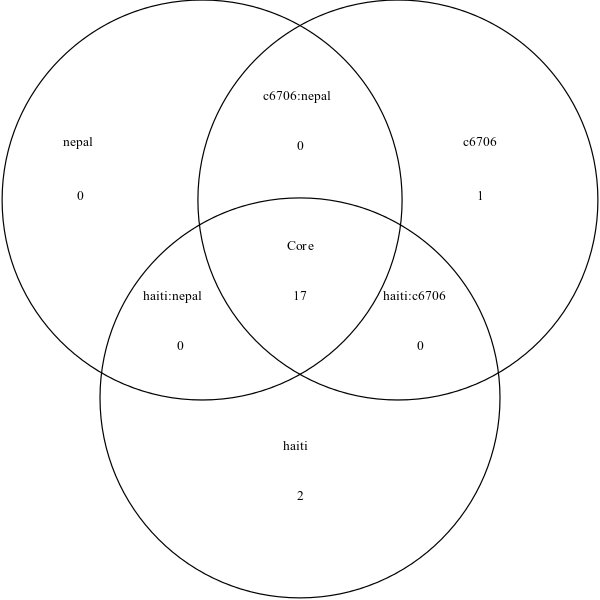

Ortholog Detection with OrthoMCL
================================

Introduction
------------

[OrthoMCL](http://genome.cshlp.org/content/13/9/2178.full) is a set of tools that can be used for identification of orthologous genes within a set of genomes.  An overview of OrthoMCL is as follows.


The **input** to OrthoMCL is a set of genes belonging to a set of genomes.  These are most likely un-ordered with no way to match up orthologous genes between genomes.  The genomes are processed by **OrthoMCL** which produces, as **output**, a file listing which proteins within which genomes are the most likely to be orthologs.

The OrthoMCL algorithm proceds through a number of different stages.  These are summarized below.

[](http://genome.cshlp.org/content/13/9/2178/F1.expansion.html)

The first step involves performing BLAST of every gene against every other gene.  The reciprocal best matches between genes are found.  These are sent through further processing and used to generate a graph of all genes linked up by their similarity scores.  The graph is sent through the software, [mcl](http://micans.org/mcl/), which detects clusters of similar scoring genes within the graph.  These clusters are printed out to a file and can be interpreted as the most likely sets of orthologs or paralogs.

Due to the complexity of running OrthoMCL, this tutorial will use the [OrthoMCL Pipeline](https://github.com/apetkau/orthomcl-pipeline) to help automate this process.  There are still a number of steps that must be performed which are listed below.

Lab
---

The data for this tutorial includes a number of genes from a set of *V. Cholerae* genomes.  Due to the amount of time it takes to run OrthoMCL, the number of genes within each genome was reduced ahead of time to ~20.  For a description of running OrthoMCL on entire set of genes from each genome please see the [following](READMELargeDataset.md).

### Step 1: Obtaining input Data

First we create a directory to contain all the files that will be created from OrthoMCL.  This can be done as follows.

```bash
$ git clone https://github.com/apetkau/microbial-informatics-2014.git
$ cd microbial-informatics-2014/labs/orthomcl/
$ ls
Answers.md  genome-groups.txt  images  READMELargeDataset.md  README.md
```

The input data for OrthoMCL consists of a set of genes.  This can be obtained from:

```bash
$ cp /Course/MI_workshop_2014/day6/annotations-cholera-small.tar.gz ./
$ tar -xvvzf annotations-cholera-small.tar.gz
```

This will extract the annotated genomes into a directory __annotations-small/__.  This directory looks as follows:

```bash
$ ls annotations-small/
2010EL-1749.faa  2010EL-1786.ffn  2010EL-1798.faa  2011EL-2317.ffn  3554-08.faa  C6706.ffn         VC-10.ffn  VC-15.faa  VC-18.ffn  VC-1.faa   VC-25.ffn  VC-6.faa
2010EL-1749.ffn  2010EL-1796.faa  2010EL-1798.ffn  2012V-1001.faa   3554-08.ffn  groups-small.txt  VC-14.faa  VC-15.ffn  VC-19.faa  VC-1.ffn   VC-26.faa  VC-6.ffn
2010EL-1786.faa  2010EL-1796.ffn  2011EL-2317.faa  2012V-1001.ffn   C6706.faa    VC-10.faa         VC-14.ffn  VC-18.faa  VC-19.ffn  VC-25.faa  VC-26.ffn
```

The files __*.faa__ contains the genes as amino acid sequences.  The files __*.ffn__ contain the genes as nucleotide sequences.  For example:

```bash
$ head annotations-small/2010EL-1749.faa
>2010EL-1749_00001 Stalked cell differentiation-controlling protein
MDARLFDNTQTLRASVLCGLSFFWALIAFLMALINFWSTRLVELASLELVCAFYSLYIYS
LAKRRIHTKQQVYLYLFILTGTTLFATYMKPLMMGVYIWSCFVPILFYIFTSARFAFVTS
...

$ head annotations-small/2010EL-1749.ffn
>2010EL-1749_00001 Stalked cell differentiation-controlling protein
ATGGATGCTAGGTTATTTGACAATACACAAACGCTTCGAGCTTCAGTGCTATGCGGCCTA
AGTTTCTTTTGGGCTTTGATCGCTTTCTTGATGGCGCTGATCAATTTCTGGTCAACACGG
...
```

### Step 2: Database Preparation

OrthoMCL requires the use of a database, such as [MySQL](http://www.mysql.com/), to do some of the analysis.  This requires a bit of manual setup.  In particular, we need to construct a location and a user in this database to store our data.  This can be done with the following commands.

```bash
$ mysql -u root
Welcome to the MySQL monitor.  Commands end with ; or \g.
Your MySQL connection id is 39
Server version: 5.5.35-0ubuntu0.13.10.2 (Ubuntu)

Copyright (c) 2000, 2013, Oracle and/or its affiliates. All rights reserved.

Oracle is a registered trademark of Oracle Corporation and/or its
affiliates. Other names may be trademarks of their respective
owners.

Type 'help;' or '\h' for help. Type '\c' to clear the current input statement.

mysql>
```

This will log you into MySQL with an administrator account (no need for a password) and give you a command prompt specifically for MySQL commands.  The commands we need to run from here involve creating a new database for OrthoMCL and creating a user to access this database.  This can be accomplished with the following.

Construct a new user **'orthomcl'@'localhost'** with the password **password**.

```sql
mysql> create user 'orthomcl'@'localhost' identified by 'password';
Query OK, 0 rows affected (0.00 sec)
```

Build a new database, called **orthomcl**, to store the data.

```sql
mysql> create database orthomcl;
Query OK, 1 row affected (0.00 sec)
```

Give the user **'orthomcl'@'localhost'** permissions to modify the database **orthomcl**.

```sql
mysql> grant all on orthomcl.* to 'orthomcl'@'localhost';
Query OK, 0 rows affected (0.00 sec)
```

Make sure permissions are properly updated.

```sql
mysql> flush privileges;
Query OK, 0 rows affected (0.00 sec)
```

Show the list of all databases.

```sql
mysql> show databases;
+--------------------+
| Database           |
+--------------------+
| information_schema |
| mysql              |
| orthomcl           |
| performance_schema |
+--------------------+
4 rows in set (0.00 sec)
```

Please make sure the *orthomcl* database exists within this list.  Now we are ready to exit MySQL.

```sql
mysql> exit
Bye
```

Now we have constructed a database, called **orthomcl** which is located on the current machine **localhost**, accessible by the user **orthomcl@localhost** with the password **password**.

### Step 3: Setup OrthoMCL Database Configuration File

All the information we supplied to construct the database in the previous step must be written into a configuration file for OrthoMCL to know how to connect to the database.  This can be accomplished with the following command:

```bash
$ orthomcl-setup-database.pl --user orthomcl --password password --host localhost --database orthomcl > orthomcl.conf
Connecting to database orthomcl on host localhost with user orthomcl ...OK
```

This generates a file, __orthomcl.conf__ which contains the neccessary database connection information and some default settings for OrthoMCL.  This file looks as follows.

```
coOrthologTable=CoOrtholog
dbConnectString=dbi:mysql:orthomcl:localhost:mysql_local_infile=1
dbLogin=orthomcl
dbPassword=password
dbVendor=mysql 
evalueExponentCutoff=-5
inParalogTable=InParalog
interTaxonMatchView=InterTaxonMatch
oracleIndexTblSpc=NONE
orthologTable=Ortholog
percentMatchCutoff=50
similarSequencesTable=SimilarSequences
```

For a more detailed description of this file please see the [OrthoMCL](http://orthomcl.org/common/downloads/software/v2.0/UserGuide.txt) documentation.

For more details on how to setup and install the OrthoMCL Pipeline please see the [install](https://github.com/apetkau/orthomcl-pipeline/blob/master/INSTALL.md) documentation.

### Step 4: Renaming input files

The OrthoMCL Pipeline takes as input the __*.faa__ amino acid sequence files, but assumes its input files end with the __*.fasta__ extension.  To properly rename these files please use the following command.

```bash
$ prename 's/\.faa/\.fasta/' annotations-small/*.faa
```

This rename all the __*.faa__ files within the **annotations-small/** directory.  These will look like:

```bash
$ ls annotations-small
2010EL-1749.fasta  2010EL-1786.ffn    2010EL-1798.fasta  2011EL-2317.ffn   3554-08.fasta  C6706.ffn         VC-10.ffn    VC-15.fasta  VC-18.ffn    VC-1.fasta   VC-25.ffn    VC-6.fasta
2010EL-1749.ffn    2010EL-1796.fasta  2010EL-1798.ffn    2012V-1001.fasta  3554-08.ffn    groups-small.txt  VC-14.fasta  VC-15.ffn    VC-19.fasta  VC-1.ffn     VC-26.fasta  VC-6.ffn
2010EL-1786.fasta  2010EL-1796.ffn    2011EL-2317.fasta  2012V-1001.ffn    C6706.fasta    VC-10.fasta       VC-14.ffn    VC-18.fasta  VC-19.ffn    VC-25.fasta  VC-26.ffn
```

### Step 5: Running OrthoMCL

In order to run OrthoMCL please use the following command.

```bash
$ orthomcl-pipeline -i annotations-small/ -o orthomcl-output-small -m orthomcl.conf --nocompliant
Starting OrthoMCL pipeline on: Tue Apr 22 18:16:11 2014
Git commit: 2467fdfe0976354f0ca42841fff777c74971f66e


=Stage 1: Validate Files =
...
```

If you get the message:

```
Warning: some tables exist already in database dbi:mysql:orthomcl:localhost:mysql_local_infile, user=orthomcl, database_name=orthomcl. Do you want to remove (y/n)?
```

Please answer __yes__.  This will simply delete any old results stored in the database so that OrthoMCL can run properly.

When the pipeline is finished you should see the following output.

```
Orthomcl Pipeline ended on Tue Apr 22 18:16:18 2014
Took 0.12 minutes to complete
Parameters used can be viewed in orthomcl.conf and /home/aaron/microbialinformatics2014/orthomcl-tutorial/orthomcl-output-small/log/run.properties
Groups file can be found in /home/aaron/microbialinformatics2014/orthomcl-tutorial/orthomcl-output-small/groups/groups.txt
```

### Step 6: Example Results

If the pipeline does not run properly, some example results can be used for the below steps.  These can be obtained with the following commands.

```bash
$ cp /Course/MI_workshop_2014/day6/orthomcl-output-small.tar.gz ./
$ tar -xvvzf orthomcl-output-small.tar.gz
```

This will extract the output to a directory named __orthomcl-output-small/__.

### Step 7: Looking at the Results

The output directory contains a number of different sub directories, log files, and analysis results.  This looks as follows.

```bash
$ ls orthomcl-output-small/
blast_dir  blast_load  blast_results  compliant_fasta  groups  log  pairs
```

The main output from OrthoMCL is a file __orthomcl-output-small/groups/groups.txt__ which contains a list of potential orthologs among the entire input genome set, one set of orthologs per line.  This file looks as follows:

```bash
$ head orthomcl-output-small/groups/groups.txt
group_1: 2010EL-1749|2010EL-1749_00001 3554-08|3554-08_01855 ...
group_2: 2010EL-1749|2010EL-1749_00002 3554-08|3554-08_01856 ...
...
```

Each gene within an ortholog group is separated by spaces.  So, for example, group_1 contains the gene `2010EL-1749_00001` from genome __2010EL-1749__ and the gene `3554-08_01855` from genome __3554-08__.

These correspond to the genes:

```bash
$ grep -A1 '2010EL-1749_00001' annotations-small/2010EL-1749.fasta
>2010EL-1749_00001 Stalked cell differentiation-controlling protein
MDARLFDNTQTLRASVLCGLSFFWALIAFLMALINFWSTRLVELASLELVCAFYSLYIYS

$ grep -A1 '3554-08_01855' annotations-small/3554-08.fasta
>3554-08_01855 Stalked cell differentiation-controlling protein
MDARLFDNTQTLRASVLCGLSFFWALIAFLMALINFWSTRLVELASLELVCAFYSLYIYS
```

### Step 8: Venn Diagram of Orthologs

Looking at text files can be useful but sometimes you will want to get an overall picture of the results and make comparisons of genes among different groups of genomes.  This can be accomplished with a script `nml_parse_orthomcl.pl` which will construct a Venn Diagram of the genes in common among a group of genomes.

This script uses the orthomcl results file __orthomcl-output-small/groups/groups.txt__ along with another file defining the sets of genomes to compare.  This file is also called a groups file (which can make it confusing sometimes).  The format is:

__genome-groups.txt:__

```
nepal: VC-25,VC-26,VC-14
haiti: 2010EL-1749,2010EL-1786,2010EL-1796,2010EL-1798,2011EL-2317,2012V-1001,3554-08,VC-10,VC-15,VC-18,VC-19,VC-1,VC-6
c6706: C6706
```

An example __genome-groups.txt__ file has been included with the rest of the data for this tutorial.

To run `nml_parse_orthomcl.pl` and generate a Venn Diagram, please do the following:

```bash
$ nml_parse_orthomcl.pl -i orthomcl-output-small/groups/groups.txt -g genome-groups.txt -s --draw -o orthomcl-stats.txt --genes
```

This will generate two main files of interest: an image file named __genome-groups.txt.svg__ and some statistics about the results in __orthomcl-stats.txt__.

The image file __genome-groups.txt.svg__ contains a Venn Diagram depeciting the numger of shared genes among the genome groups within the __genome-groups.txt__ file.  This looks as follows:



This shows that there are 17 genes within the core genome of all genomes analysed.  There are 2 unique genes to the __haiti__ group and there is 1 unique gene in c6706 not shared among any genomes.

The statistics file __orthomcl-stats.txt__ shows some summary statistics about the OrthoMCL results.  An example of this information is:

```
Genomes not included in group file:


Number of genes seen in the following genomes:

VC-14: 17
2011EL-2317: 19
VC-26: 17
2010EL-1796: 19
3554-08: 19
VC-15: 19
2010EL-1749: 19
VC-19: 19
2010EL-1798: 19
2012V-1001: 19
VC-1: 19
C6706: 19
VC-10: 19
VC-25: 17
VC-6: 19
2010EL-1786: 19
VC-18: 19

Total genes seen: 317

'Core' gene sets that is contained: 17 genomes has 17 genes
Found 2 for the following set: haiti
2010EL-1749_02114,2010EL-1796_03119,2010EL-1798_02875,2011EL-2317_03311,2012V-1001_01554,3554-08_03049,VC-10_00387,VC-15_00297,VC-18_00534,VC-19_00302,VC-1_00125,VC-6_00154,Vch1786_I0090
2010EL-1749_02115,2010EL-1796_03118,2010EL-1798_02876,2011EL-2317_03310,2012V-1001_01555,3554-08_03050,VC-10_00386,VC-15_00298,VC-18_00533,VC-19_00303,VC-1_00124,VC-6_00155,Vch1786_I0091
Found 1 for the following set: c6706
C6706_01322,C6706_01324
```

One particular area to pay attention to is the __Genomes not included in group file__ section.  If this section has genomes listed, then these genomes were excluded from the analysis and you may have to adjust the __genomes-groups.txt__ file to include them and re-run `nml_parse_orthomcl.pl`.

Another area to take a look at, right below __'Core' gene sets that is contained:__ contains a list of the gene ids unique to each genome group defined, as well as any other genome groups that weren't considered.  For example, for the set __haiti__ the 2 unique sets of genes are printed within this file.  To view more information about each of these genes, we can use `grep` to search through the input files.  For example, for the first unique set of genes for the __haiti__ group we have the gene id **2010EL-1749_02114**.  To find more information about this gene please run the following.

```bash
$ grep '2010EL-1749_02114' annotations-small/*.fasta
annotations-small/2010EL-1749.fasta:>2010EL-1749_02114 DNA polymerase V subunit UmuC
```

This shows the product of the gene (as annotated by prokka) and the file it was found within.

Questions
---------

### Question 1
Repeat the `grep` command to search for the products of the other gene ids (such as **2010EL-1796_03119**, **VC-10_00387**, and **Vch1786_I0090**) in the first unique haiti gene set.  What are all these products?  Are they all the same?  Why or why not?

### Question 2

The above steps only walked through running a small subsample of genes for each of the genomes due to time constraints.  To see what sort of results you would get with a full run through OrthoMCL please copy and extract the **example-large.tar.gz** flie.  This can be obtained with the commands.

```bash
$ cp /Course/MI_workshop_2014/day6/example-large.tar.gz ./
$ tar -xvzf example-large.tar.gz
```

This extracts the full dataset to a directory, **example-large/**, which contains the full set of annotations and an OrthoMCL groups.txt file from running OrthoMCL.  More information on how this dataset was run can be found at [READMELargeDataset.md](READMELargeDataset.md).

Run the `nml_parse_orthomcl.pl` script on this dataset.  What does the Venn Diagram look like?  How many genes are within the core genome?

[Answers](Answers.md)
